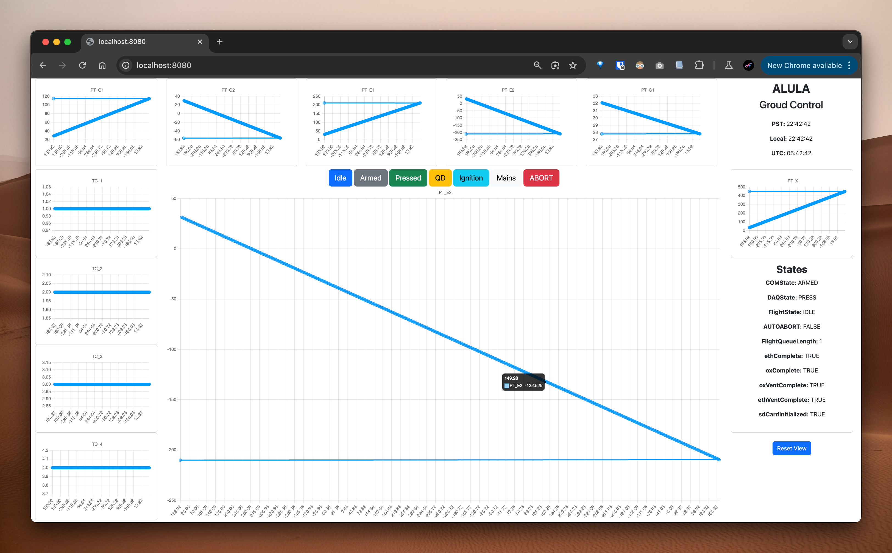

# Avionics Dashboard
An extremely basic avionics dashboard to visualize data coming in from an esp32/arduino.

## Screenshot:


## Setup:

1. Flash code onto Arduino, run it but do not open the serial monitor.

2. Go to index.js, change to the correct COM port on line 6.

3. If this is the first time setting up (cwd doesn't have `node_modules` folder), do `npm install` (Note: NodeJS v20 LTS+ required!)

4. Start using `node index.js`

5. Profit!

## Stack/Deps:
Arduino struct -> JSON for writing to COM: `ArduinoJson.h` on Arduino Library

Serial connection + parsing: `serialport` on NPM

The rest of the stack is quite simple [Frontend -> Backend]:
```
ChartJS
EJS

SocketIO
ExpressJS
serialport
NodeJS

ArduinoJson.h
```

## Notes:
Ignore the backups directory - this was used before we had a working Git solution
